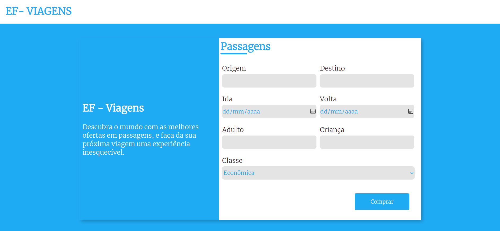

# Projeto Agência de Viagens

## 📖 Descrição

Esta aplicação é um site para compra de passagens. O projeto foi desenvolvido como objeto de estudo durante o curso de PHP na Alura. No projeto não é utilizado banco dados, a aplicação só armazena as informações e disponibiliza em uma tabela para o usuário.

## 🛠️ Tecnologias

## ⌛ Inicialização

Esse projeto foi desenvolvido em ambiente Windows, utilizando a ferramenta VSCode e as tecnologias citadas anteriormente.

## 🌎 Implementações Futuras

📌 Implementar banco de dados
